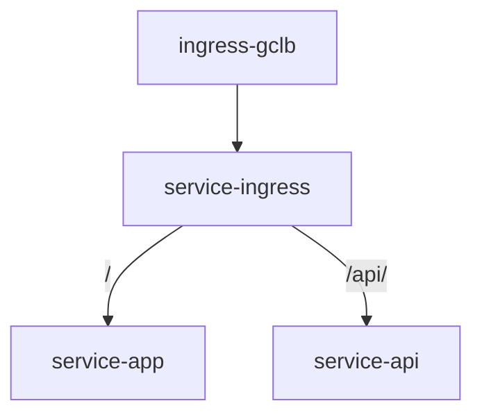

# Internal ingress service setup


## Create tls cert
```sh
kubectl create secret tls nino.baby.tls \
    --cert=tls/certificate.crt \
    --key=tls/private.key
```

## Create ghcr.io secret on k8s

```sh
echo $CR_PAT=YOUR_GITHUB_PAT
kubectl create secret docker-registry nino-ghcr --docker-server=https://ghcr.io --docker-username=nino.chang@swag.live --docker-password=$CR_PAT
```
